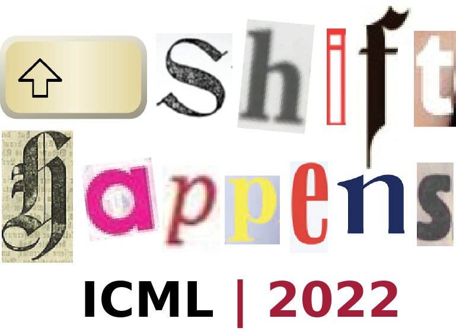

Shift Happens: Crowdsourcing metrics and test datasets beyond ImageNet
======================================================================

Welcome! This is the official code for the ICML 2022 workshop on crowdsourcing 
novel metrics and test datasets for model evaluation on ImageNet scale.

While the popularity of robustness benchmarks and new test datasets
increased over the past years, the performance of computer vision models
is still largely evaluated on ImageNet directly, or on simulated or
isolated distribution shifts like in ImageNet-C. 

**Goal:** This workshop aims to enhance and consolidate the landscape of robustness evaluation datasets for
computer vision and collect new test sets and metrics for quantifying desirable or problematic
properties of computer vision models. Our goal is to bring the robustness, domain
adaptation, and out-of-distribution detection communities together to work on a new
**broad-scale benchmark** that tests diverse aspects of current computer
vision models and guides the way towards the next generation of models.

Over the course of the workshop, the package will be populated with new tasks, metrics
and datasets that are suitable for understanding the properties of ImageNet scaled
computer vision models beyond the metrics that are typically reported.

How to use this benchmark
-------------------------
For now, you can use the benchmark by installing it from this repository:

.. code::

    $ pip install git+https://github.com/shift-happens-benchmark/icml-2022.git

After the workshop you will be able to use this package and all its included tasks with:

.. code::
    
    $ pip install shifthappens

How to contribute
-----------------

Since the aim of this workshop & package is to build a unified platform for datasets
investigating and highlighting interesting properties of ImageNet-scale vision models,
we are looking for **your** contribution. If you decide to contribute a new task to the 
benchmark before ICML 2022 please consider officially submitting it to the workshop - for
more details see `here <https://shift-happens-benchmark.github.io/call_for_papers.html>`_.

Adding tasks and datasets
^^^^^^^^^^^^^^^^^^^^^^^^^

Tasks in this benchmark package should highlight interesting properties of vision models.
For one, this means that you can integrate new datasets you built. In addition, you can also
propose new evaluation schemes (i.e. new tasks) for already existing datasets, like test-time adaptation evaluation
on robustness datasets. You can think about examples/scenarios that might be of interest for industrial
applications just as well as purely academic examples - as long as the new tasks/datasets highlight 
an interesting behavior of existing models, it fits into this package! 

New tasks should be added to the ``shifthappens.tasks`` module.

Please refer to the `API documentation <https://shift-happens-benchmark.github.io/api.html>`_ for 
more details, as well as minimal examples. Moreover, inside the `examples <examples>`_ folder you can 
find implementations example implementations of tasks for the benchmark.

Adding models
^^^^^^^^^^^^^

Models should be added to the ``shifthappens.models`` module. An example implementation
for wrapping a torchvision model is given in ``shifthappens.models.torchvision``. Note
that implementations are framework agnostic; further options include TensorFlow, and jax
models, for which we will add example implementations soon.

License and contributors
------------------------

All code in this repository is released under an Apache 2.0 license, which includes
external contributions. All data used for creating new benchmarks should minimally be
available without constrains for research purposes, and optionally free for commercial 
use as well.

Datasets `without an explicit license statement <https://choosealicense.com/no-permission/>`_ 
will not be accepted into the benchmark.

When preparing a PR, please make sure that your PR contains information on the license that
is applicable to any data files required for your benchmark. Also add the name of all license
holders to the ``LICENSE`` file in this repository *before* merging the PR.

**When using the benchmark, please make sure to cite all papers corresponding to datasets
and tasks in the benchmark.**

Shift Happens 2022 Contributors
^^^^^^^^^^^^^^^^^^^^^^^^^^^^^^^

We are currently in the process of merging contributions to the Shift Happens Workshop at ICML'22
into the benchmark. You can see the progress
`in the list of pull requests <https://github.com/shift-happens-benchmark/icml-2022/pulls?q=is%3Aopen+is%3Apr+label%3Atask>`_.

Here is a list of all full contributions that plan to submit to the benchmark. Once PRs are merged,
we will include bibtex entries to the respective technical reports as well. 

ImageNet-Patch: A Dataset for Benchmarking Machine Learning Robustness against Adversarial Patches.
	Maura Pintor, Daniele Angioni, Angelo Sotgiu, Luca Demetrio, Ambra Demontis, Battista Biggio, Fabio Roli.

MetaShift: A Dataset of Datasets for Evaluating Contextual Distribution Shifts.
	Weixin Liang, Xinyu Yang, James Y. Zou.

When does dough become a bagel?Analyzing the remaining mistakes on ImageNet.
	Vijay Vasudevan, Benjamin Caine, Raphael Gontijo-Lopes, Sara Fridovich-Keil, Rebecca Roelofs.

3D Common Corruptions for Object Recognition.
	Oguzhan Fatih Kar, Teresa Yeo, Amir Zamir.

CCC: Continuously Changing Corruptions.
	Ori Press, Steffen Schneider, Matthias Kuemmerer, Matthias Bethge.

Classifiers Should Do Well Even on Their Worst Classes.
	Julian Bitterwolf, Alexander Meinke, Valentyn Boreiko, Matthias Hein.

Evaluating Model Robustness to Patch Perturbations.
	Jindong Gu, Volker Tresp, Yao Qin.

ImageNet-Cartoon and ImageNet-Drawing: two domain shift datasets for ImageNet.
	Tiago Salvador, Adam M Oberman.

ImageNet-D: A new challenging robustness dataset inspired by domain adaptation.
	Evgenia Rusak, Steffen Schneider, Peter Vincent Gehler, Oliver Bringmann, Wieland Brendel, Matthias Bethge.

Lost in Translation: Modern Image Classifiers still degrade even under simple Translations.
	Leander Kurscheidt, Matthias Hein.

SI-Score.
	Jessica Yung, Rob Romijnders, Alexander Kolesnikov, Lucas Beyer, Josip Djolonga, Neil Houlsby, Sylvain Gelly, Mario Lucic, Xiaohua Zhai.

The Semantic Shift Benchmark.
	Sagar Vaze, Kai Han, Andrea Vedaldi, Andrew Zisserman.

Additional benchmark datasets
^^^^^^^^^^^^^^^^^^^^^^^^^^^^^

Benchmarking Neural Network Robustness to Common Corruptions and Perturbations.
  Dan Hendrycks and Thomas Dietterich

.. code::

  @article{hendrycks2019robustness,
    title={Benchmarking Neural Network Robustness to Common Corruptions and Perturbations},
    author={Dan Hendrycks and Thomas Dietterich},
    journal={Proceedings of the International Conference on Learning Representations},
    year={2019}
  }

The Many Faces of Robustness: A Critical Analysis of Out-of-Distribution Generalization.
  Dan Hendrycks, Steven Basart, Norman Mu, Saurav Kadavath, Frank Wang, Evan Dorundo, Rahul Desai,
  Tyler Zhu, Samyak Parajuli, Mike Guo, Dawn Song, Jacob Steinhardt and Justin Gilmer

.. code::

  @article{hendrycks2021many,
    title={The Many Faces of Robustness: A Critical Analysis of Out-of-Distribution Generalization},
    author={Dan Hendrycks and Steven Basart and Norman Mu and Saurav Kadavath and Frank Wang and Evan Dorundo and Rahul Desai and Tyler Zhu and Samyak Parajuli and Mike Guo and Dawn Song and Jacob Steinhardt and Justin Gilmer},
    journal={ICCV},
    year={2021}
  }

Objectnet: A large-scale bias-controlled dataset for pushing the limits of object recognition models.
  Andrei Barbu, David Mayo, Julian Alverio, William Luo, Christopher Wang,
  Dan Gutfreund, Josh Tenenbaum and Boris Katz

.. code::

  @article{barbu2019objectnet,
    title={Objectnet: A large-scale bias-controlled dataset for pushing the limits of object recognition models},
    author={Barbu, Andrei and Mayo, David and Alverio, Julian and Luo, William and Wang, Christopher and Gutfreund, Dan and Tenenbaum, Josh and Katz, Boris},
    journal={Advances in neural information processing systems},
    volume={32},
    year={2019}
 }