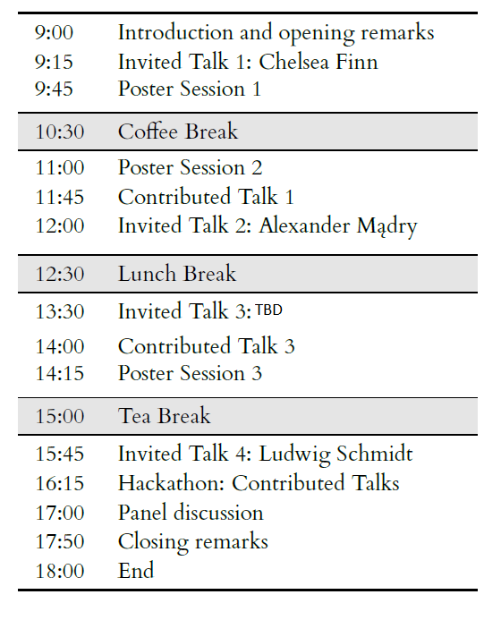

Main event 
==========

During the workshop, we will encourage discussion on (1) model properties that are often overlooked when
evaluating machine learning models and should be included in a comprehensive benchmark, on (2) important practical
properties of evaluation datasets and criteria, and on (3) currently unavailable evaluations that would be desirable
to be developed in the future. Furthermore, we will host an online forum in the period between the camera-ready
deadline and the workshop to facilitate constructive discussions about the accepted datasets.

Timetable Outline (tentative)
^^^^^^^^^^^^^^^^^^^^^^^^^^^^^

