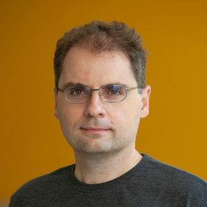
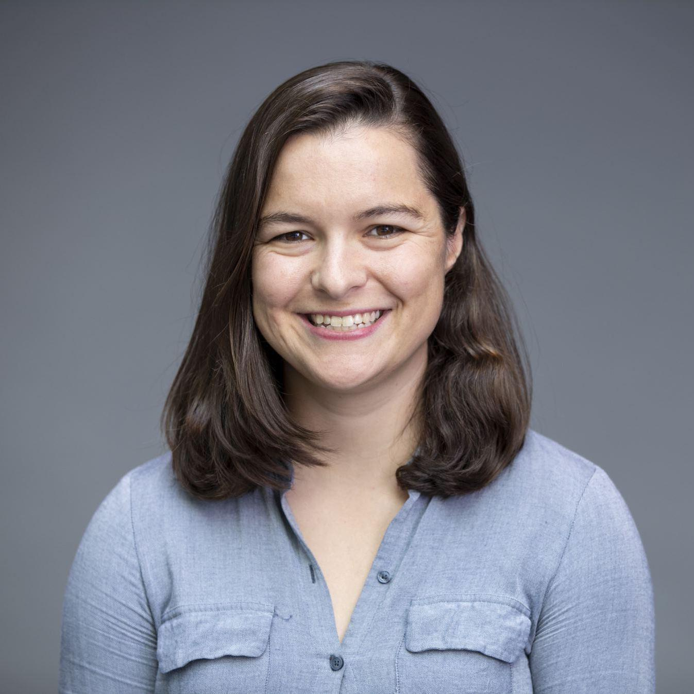
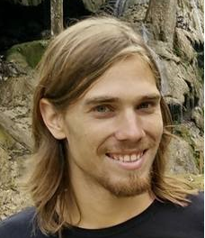
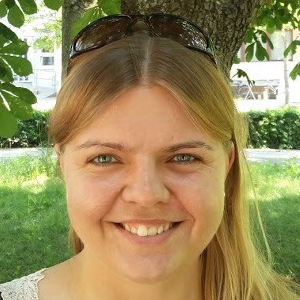
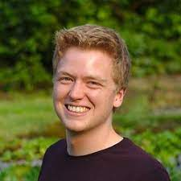
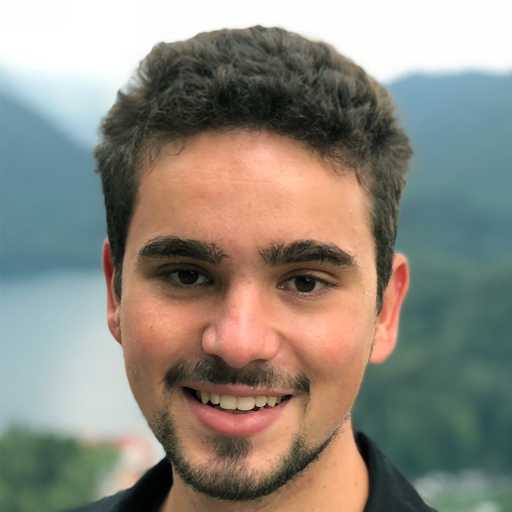
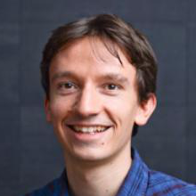
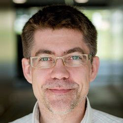

Shift happens: Crowdsourcing metrics and test datasets beyond ImageNet
======================================================================

*ICML 2022 workshop*

**We aim to create a community-built benchmark suite for ImageNet models comprised of new datasets for OOD robustness
and detection, as well as new tasks for existing OOD datasets.**

While the popularity of robustness benchmarks and new test datasets
increased over the past years, the performance of computer vision models
is still largely evaluated on ImageNet directly, or on simulated or
isolated distribution shifts like in ImageNet-C. 

**Goal:** This workshop aims to enhance and consolidate the landscape of robustness evaluation datasets for
computer vision and collect new test sets and metrics for quantifying desirable or problematic
properties of computer vision models. Our goal is to bring the robustness, domain
adaptation, and out-of-distribution detection communities together to work on a new
**broad-scale benchmark** that tests diverse aspects of current computer
vision models and guides the way towards the next generation of models.

+-----------------------------------------------------------------------+
| |overview.svg|                                                        |
+=======================================================================+
| *Overview over the benchmark suite: You can contribute tasks and      |
| corresponding datasets highlighting                                   |
| interesting aspects of ImageNet-scale models. We will evaluate        |
| current and future models on the benchmark suite, testing their       |
| robustness, calibration, odd detection, and consistency, and make the |
| results intuitively accessible in the form of scorecards.*            |
+-----------------------------------------------------------------------+

**All accepted submissions will be part of the open-source** ``shifthappens`` **benchmark suite. This will ensure that after the workshop all benchmarks are accessible to the community.**

Focus Topics
-------------

Submissions to the benchmark suite will focus on datasets and evaluation algorithms falling into one or more of the categories
below:

1. **Robustness to domain shifts:** A labeled
   dataset where the labels are (a subset of) the 1000 labels of
   ImageNet-2012. Optionally, model calibration, uncertainty, or open
   set adaptation can be tested. We especially encourage submissions
   focusing on practically relevant distribution shifts.

2. **Out-of-distribution detection:** A labeled or unlabeled dataset of
   images that do not contain objects from any of the 1000 ImageNet-2012
   classes.

3. **New robustness datasets:** Beyond the standard robustness evaluation
   settings (with covariate shift, label shift, …), the workshop format
   enables submission of datasets that evaluate non-standard metrics
   such as the consistency of predictions, influence of spurious
   correlations in the dataset.

4. **New model characteristics:** Metrics and evaluation techniques that
   help examine the strengths, weaknesses and peculiarities of models in newly
   highlighted respects. Evaluations can utilize established datasets (or 
   subsets thereof) or come with their own dataset.
   
   
Submissions
-----------

The benchmark suite will be available on 
`GitHub <https://github.com/shift-happens-benchmark/icml-2022>`__.
The documentation for the benchmark's API is available `here <https://shift-happens-benchmark.github.io/icml-2022/>`__.
Please see our :doc:`call_for_papers` for more details.

Participants will have the opportunity to co-author a paper summarizing their contributions to the benchmark suite.

Important Deadlines
-------------------

- Submission Deadline: mid-end May, 2022 (final date TBA)
- Reviews Posted: June 3, 2022
- Acceptance Notification: June 6, 2022
- Camera and Dataset Ready: July 1, 2022
- ICML 2022 Workshop Dates: July 22 and 23 (final date TBA)

Please note that it is **not required** to post the final dataset by the submission deadline since we are interested in new ideas for feasible datasets.
It is sufficient to start working on final dataset collections after the acceptance notification until the camera ready deadline.

Additional information about submission dates and the submission format can be found in :doc:`call_for_papers`.
Also, please consider our :doc:`call_for_reviewers`.

Prizes and Travel Grants
-------------------

To be announced soon.

Invited Speakers
----------------

.. list-table:: 
    :widths: 70 30
    :header-rows: 0
    
    * - `Aleksander Mądry <https://people.csail.mit.edu/madry/>`__  is the Cadence Design Systems Professor of Computing at MIT, leads the MIT Center for Deployable Machine Learning as well as is a faculty co-lead for the MIT AI Policy Forum. His research interests span algorithms, continuous optimization, and understanding machine learning from a robustness and deployability perspectives. 
      - |madry|
    * - `Chelsea Finn <https://ai.stanford.edu/~cbfinn/>`__ is an Assistant Professor in Computer Science and Electrical Engineering at Stanford University. Her lab, IRIS, studies intelligence through robotic interaction at scale, and is affiliated with SAIL and the ML Group. Chelsea also spends time at Google as a part of the Google Brain team. She is interested in the capability of robots and other agents to develop broadly intelligent behavior through learning and interaction.
      - |finn|
    * - `Ludwig Schmidt <https://people.csail.mit.edu/ludwigs/>`__ is an assistant professor in the Paul G. Allen School of Computer Science & Engineering at the University of Washington. Ludwig’s research interests revolve around the empirical and theoretical foundations of machine learning, often with a focus on datasets, evaluation, and reliable methods. Ludwig completed his PhD at MIT under the supervision of Piotr Indyk and was a postdoc at UC Berkeley with Benjamin Recht and Moritz Hardt. Ludwig received a Google PhD fellowship, a Microsoft Simons fellowship, a new horizons award at EAAMO, a best paper award at ICML, and the Sprowls dissertation award from MIT.
      - |schmidt|
    * - Additional speakers TBA
      - ...

Organizers
----------

.. list-table:: 
    :widths: 25 25 25 25

    * - |julian|
      - |evgenia|
      - |steffen|
      - |roland|
    * - `Julian Bitterwolf <https://uni-tuebingen.de/fakultaeten/mathematisch-naturwissenschaftliche-fakultaet/fachbereiche/informatik/lehrstuehle/maschinelles-lernen/team/julian-bitterwolf-msc/>`__
      - `Evgenia Rusak <https://scholar.google.com/citations?user=XKc19kkAAAAJ&hl=en&oi=ao>`__
      - `Steffen Schneider <https://stes.io>`__
      - `Roland S. Zimmermann <https://rzimmermann.com/>`__
    * - |matthiasb|
      - |wieland|
      - |matthiash| 
      -
    * - `Matthias Bethge <http://bethgelab.org/>`__
      - `Wieland Brendel <https://scholar.google.com/citations?user=v-JL-hsAAAAJ&hl=en&oi=ao>`__
      - `Matthias Hein <https://uni-tuebingen.de/fakultaeten/mathematisch-naturwissenschaftliche-fakultaet/fachbereiche/informatik/lehrstuehle/maschinelles-lernen/team/prof-dr-matthias-hein/>`__
      -

.. |overview.svg| image:: overview.svg

.. |schmidt| image:: organizer_speaker_pics/ludwig_schmidt.jpg

.. toctree::
    :maxdepth: 2
    :hidden:

    Call for Submissions <call_for_papers>
    Call for Reviewers <call_for_reviewers>
    Benchmark API Docs <api>
